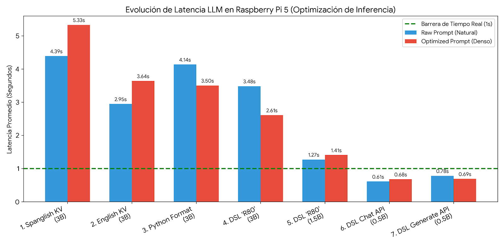

---

# 🚀 PoC: Control de Tracción Diferencial mediante Edge AI (SLM)

Esta Prueba de Concepto (PoC) valida la viabilidad de utilizar **Modelos de Lenguaje Pequeños (SLMs)** ejecutados de forma 100% local en una **Raspberry Pi 5** para la interpretación de lenguaje natural y su traducción a comandos.

## 🛠 Stack Tecnológico

* **Computadora de a Bordo (OBC):** Raspberry Pi 5 (8GB RAM).
* **Motor de Inferencia:** [Ollama](https://ollama.ai/) (Local).
* **Modelo Base:** `qwen2.5:0.5b` (Cuantizado para latencia ultra-baja).
* **Interfaz de Comunicación:** Web API (FastAPI) para integración externa.
* **Protocolo de Control:** DSL (Domain Specific Language) de 2-4 tokens.

---

## 🏗 Arquitectura y Lógica de Control

El núcleo del proyecto es la migración de formatos pesados (como JSON) hacia un protocolo de control **Ultra-Lean**. Esto permite que la IA se comporte como un transpilador de baja latencia.

### Configuración del Modelfile (Inferencia Determinista)

El modelo se ha "especializado" mediante un prompt de sistema que restringe la creatividad para asegurar la estabilidad del hardware.

```dockerfile
FROM qwen2.5:0.5b

# Comportamiento: Compilador de una sola línea
SYSTEM "Output 1 command. Move: [F,B,L,R,S][0-100] (e.g. R80). Target: W_[PLACE] (e.g. W_PUERTA, W_BASE). No prose."

# Optimización de Inferencia
PARAMETER temperature 0.0    # Elimina la variabilidad en las respuestas
PARAMETER stop "\n"          # Finaliza la ejecución tras el comando útil
PARAMETER num_ctx 512        # Ventana de contexto optimizada para memoria RAM
PARAMETER num_thread 4       # Ejecución dedicada en los 4 núcleos de la Pi 5

```

---

## 📊 Análisis de Resultados de Rendimiento

### 1. Evolución de Latencia por Fases

El objetivo crítico fue romper la barrera del segundo ($< 1s$) para aplicaciones de control en tiempo real.

| Fase | Modelo | Formato de Salida | Latencia Promedio | Estado |
| --- | --- | --- | --- | --- |
| **Fase 1: Baseline** | Qwen 3B | JSON Estructurado | **7.80s** | 🐌 Inviable |
| **Fase 2: English Refactor** | Qwen 3B | Prosa Técnica | **4.13s** | ⚠️ Latencia Alta |
| **Fase 3: DSL (R80)** | Qwen 1.5B | Letra + Valor | **1.38s** | ✅ Operativo |
| **Fase 4: Ultra-Lean** | **Qwen 0.5B** | **Letra + Valor** | **0.64s** | ⚡ **Real-Time** |

### 2. Comparativa de Abstracción Semántica (3B vs 1.5B)

A pesar de la latencia, los modelos más robustos demostraron mayor precisión en matices lingüísticos:

| Input | Qwen 1.5B (Acción) | Qwen 3B (Acción) | Hallazgo |
| --- | --- | --- | --- |
| *"Muuuy despacio a la izq"* | `L100` (Erróneo) | `L1` (Exitoso) | El 3B tiene mejor lógica matemática. |
| *"Corre!"* | N/A | `F100` (Exitoso) | El 3B asocia urgencia con velocidad máxima. |
| *"Quedate quieto"* | `S0` (Frenar) | `S0` (Frenar) | Ambos asocian reposo con emergencia. |



---

## 🧠 Notas de Optimización

Se aplicaron tres estrategias clave para reducir la carga computacional en un **~90%**:

1. **Protocolo DSL (Domain Specific Language):** Reemplazar JSON (`{"cmd": "forward"}`) por tokens atómicos (`F50`) eliminó el "Impuesto de Generación". Cada coma o paréntesis ahorrado representa ~100ms de CPU ganados.
2. **Normalización Lingüística:** Se observó que el modelo es más estable operando en inglés técnico. Esto reduce las "alucinaciones de tokens" y estabiliza el tiempo de inferencia (*prefill*).
3. **Control de Generación (`num_predict`):** Limitar la salida a una longitud fija impide que el modelo intente explicar su decisión, liberando los núcleos de la Pi 5 inmediatamente tras la entrega del comando.

> ### 🔎 Análisis del Caso Borde: `B,F,50`
> 
> 
> En el modelo 0.5B, prompts ambiguos pueden generar duplicación de tokens. Este fenómeno de "confusión semántica" se mitiga mediante un `System Prompt` más rígido y el uso estricto de parámetros de parada.

---

## 📍 Estado del Proyecto y Próximos Pasos

* **Estado:** PoC de Software validada. Inferencia local estable en sub-segundo.
* **Próximo Hito:** Integración física vía UART con **Pi Pico 2**.
* **Objetivo Final:** Transmisión de tramas DSL para el control de puentes H y motores de tracción diferencial.

---
